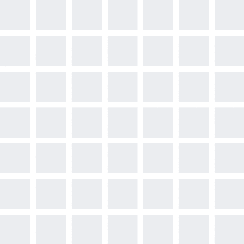

### Hola, soy Herr-code 👋 

## Acerca de mi...
```js
const herr-code = {
  pronouns: "he/him",
  code: ["JavaScript", "HTML", "CSS"],
  testing: ["Jest JS"],
  tools: ["Figma", "Jupyter notebooks"],
  cms: ["Wordpress"],
  ssg: ["Hugo"],
  codeEditors: ["VSCode", "Sublime Text 3"],
  community: ["Launch X", "Innovacción Virtual"],
  links: {},
  
  othersTecnologies : {
        versionControl: 'Git',
        softwareHosting: 'GitHub',
    }
};

frameworks = async () => await learn('Vue3.js');
node = async () => await learn()
```
<!--
**herr-code/herr-code** is a ✨ _special_ ✨ repository because its `README.md` (this file) appears on your GitHub profile.

Here are some ideas to get you started:

- 🔭 I’m currently working on ...
- 🌱 I’m currently learning ...
- 👯 I’m looking to collaborate on ...
- 🤔 I’m looking for help with ...
- 💬 Ask me about ...
- 📫 How to reach me: ...
- 😄 Pronouns: ...
- ⚡ Fun fact: ...
-->
